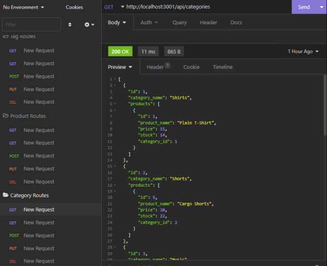

# E-Commerce Backend

This is the backend for an e-commerce site that uses express, sequelize, and MySQL for the database. The user is able get certain tables from the database, add new items, update certain items, and delete items from the database.

[ISC](https://choosealicense.com/licenses/isc/)

## Table Of Contents

- [Usage](#usage)
- [Install](#install)
- [Contribute](#contributing)
- [Testing](#tests)
- [Questions](#questions)

## Usage

The main usage is to easily create, update, and delete data from the database.
 

## Install

- To install, run `npm install` to download the packages in the package json file which will allow you to run this application.
- To start the application, run `npm start`

## Contributing

Clone Project, add your changes, and make a pull request!

## Tests

NA

## Questions

_Reach Out!_

Github: [TDGNate](https://github.com/TDGNate)

Email: itsnzte@gmail.com
